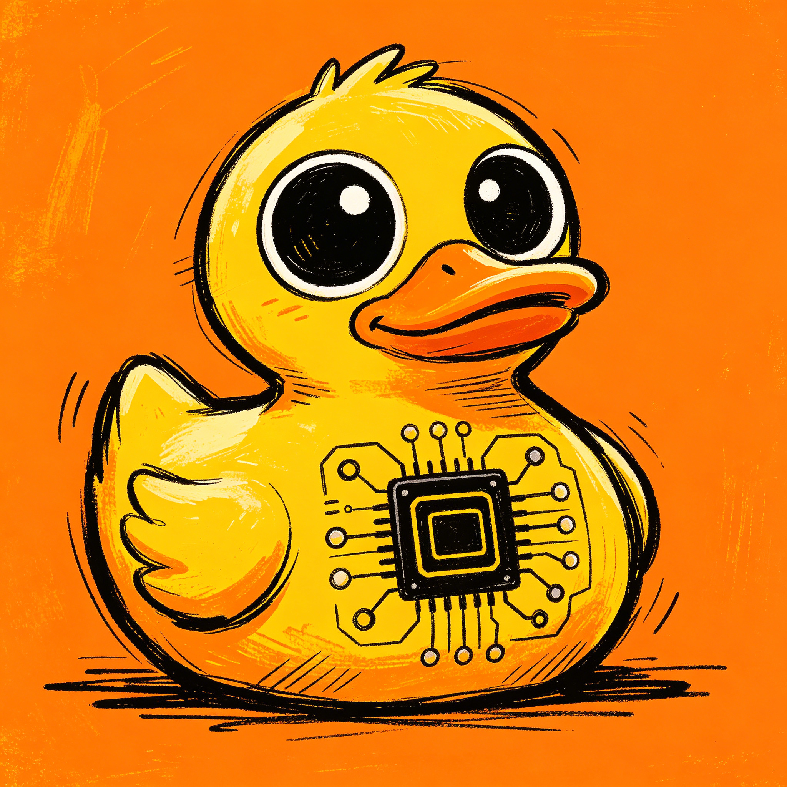
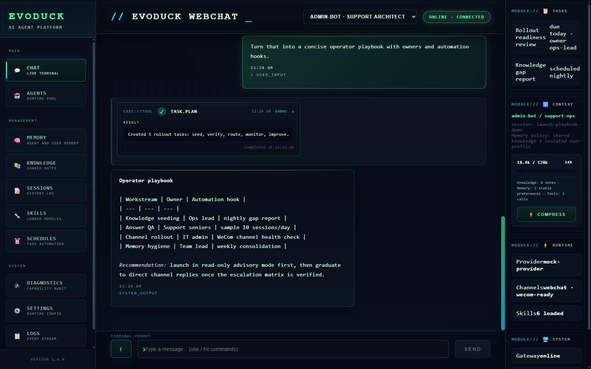

# EvoDuck

[English](README.md) | [简体中文](README.zh-CN.md)

EvoDuck 是一个用 Go 编写的本地优先 AI Agent 框架，面向个人使用、客服支持和企业内部团队支持场景。

它在一个轻量运行时中，同时提供原生记忆、知识沉淀、上下文压缩、Skill 进化、MCP 集成、语言无关插件扩展和多渠道接入能力。





## 为什么是 EvoDuck

EvoDuck 面向的是那些希望 Agent 可观察、可扩展、可长期运行，而不是只停留在一次性聊天体验的使用者。

它把配置、记忆、日志、会话和运行时资产都保留在操作者身边，目标是启动快、运行轻、长期使用后还能持续变强。

## 核心亮点

- 原生支持 `admin`、`employee`、`customer` 权限边界，同时面向个人和企业场景。
- 对个人用户可以直接使用 `admin` 模式，对企业场景可以承接客服和内部团队支持工作。
- 以极少配置快速进入可用状态，尤其适合支持类工作负载。
- 内建原生知识库和原生记忆系统，Agent 可以随着长期使用持续沉淀上下文。
- 具备自动记忆提取与记忆整理能力，不把每次会话都当成孤立聊天记录。
- 内建原生上下文压缩机制，在保持能力平衡的同时尽量节省 token 消耗。
- 支持 Skill 进化，可以把重复经验逐步演进成可复用的操作知识。
- 原生保留 MCP 支持，可以直接复用成熟丰富的 MCP 生态，而不需要从头重建集成层。
- 提供更便捷、语言无关的插件机制，支持 `tool`、`provider`、`channel`、`hook` 扩展。
- 原生支持 `webchat`、`weixin`、`wecom` 等真实渠道接入。
- 使用 Go 实现，启动快、执行响应快、资源占用低。

## 典型使用路径

1. 安装或自行构建 `evoduck` 二进制。
2. 第一次运行 `evoduck run`。
3. EvoDuck 自动创建默认配置和运行目录。
4. 如果当前配置仍是默认模板，则自动进入 Setup Wizard。
5. 初始化完成后，再通过 channel、Skill、MCP 和插件扩展能力。

## 扩展机制

EvoDuck 不依赖单一扩展模型。

- 用 Skill 封装可复用的行为模式和操作经验。
- 用 MCP 快速接入已经成熟的外部工具生态。
- 用插件机制更轻量地接入自己的工具、provider、channel 或 hook。
- 插件机制是语言无关的，更适合对接内部系统、私有服务和自定义业务逻辑，而不需要把所有扩展都塞进 Go 主程序。

对于第三方 Skill，用户可以把本地目录、zip 包或仓库地址交给 agent，让它完成安装、校验，并在来源属于其他 agent 生态时按 EvoDuck 的 `SKILL.md` 规范进行适配。见 [Skill 与 MCP](docs/zh-CN/guides/skills-and-mcp.md)。

## 安装

完整的当前安装、卸载、更新和首次运行行为，请先看 [安装与首次启动](docs/zh-CN/guides/install.md)。

### 快速安装

Windows PowerShell：

```powershell
irm https://raw.githubusercontent.com/chawuciren/evoduck/main/scripts/install.ps1 | iex
```

使用 HTTP 代理：

```powershell
$env:HTTP_PROXY="http://127.0.0.1:7897"
$env:HTTPS_PROXY="http://127.0.0.1:7897"
irm -Proxy "http://127.0.0.1:7897" https://raw.githubusercontent.com/chawuciren/evoduck/main/scripts/install.ps1 | iex
```

macOS/Linux：

```sh
curl -fsSL https://raw.githubusercontent.com/chawuciren/evoduck/main/scripts/install.sh | sh
```

安装脚本会把 EvoDuck 安装到用户级 bin 目录，并在安装完成后调用 `evoduck install` 注册自启动。重复运行同一个脚本会更新已有安装。
### 快速卸载

Windows PowerShell：

```powershell
irm https://raw.githubusercontent.com/chawuciren/evoduck/main/scripts/uninstall.ps1 | iex
```

macOS/Linux：

```sh
curl -fsSL https://raw.githubusercontent.com/chawuciren/evoduck/main/scripts/uninstall.sh | sh
```

卸载脚本会先停止正在运行的服务，然后移除自启动、删除已安装二进制、移除安装脚本写入的 PATH 项，并询问是否删除运行数据。CLI 命令 `evoduck uninstall` 只负责移除自启动。

### 手动安装

如果在线脚本不可用，可以从最新 GitHub Release 手动安装：

1. 打开 `https://github.com/chawuciren/evoduck/releases/latest`。
2. 下载对应系统的资产：
   - Windows x64: `evoduck-windows-amd64.zip`
   - Windows ARM64: `evoduck-windows-arm64.zip`
   - macOS Intel: `evoduck-darwin-amd64.tar.gz`
   - macOS Apple Silicon: `evoduck-darwin-arm64.tar.gz`
   - Linux x64: `evoduck-linux-amd64.tar.gz`
   - Linux ARM64: `evoduck-linux-arm64.tar.gz`
3. 解压压缩包。压缩包根目录里会有 Windows 的 `evoduck.exe`，或 macOS/Linux 的 `evoduck`。
4. 把可执行文件放到用户级 bin 目录：
   - Windows: `%USERPROFILE%\.local\bin\evoduck.exe`
   - macOS/Linux: `~/.local/bin/evoduck`
5. 把这个 bin 目录加入 `PATH`。
6. 重新打开终端，用 `evoduck version` 验证。

手动安装后的第一次使用：

1. 运行 `evoduck run`。
2. EvoDuck 会在 `.evoduck` 下创建默认配置和运行目录。
3. 如果 provider 尚未配置，程序会自动进入 setup wizard。
4. 后续用 `evoduck channel add` 配置 channel，也可以直接编辑配置文件。

### 更新已有安装

```bash
evoduck update
```

常用选项：

```bash
evoduck update --check
evoduck update --version v0.1.0
evoduck update --force
evoduck update --install-dir ~/.local/bin
```

环境变量覆盖：

- `EVODUCK_VERSION`: 指定 release 版本，默认 `latest`
- `EVODUCK_INSTALL_DIR`: 覆盖安装目录
- `EVODUCK_REPO`: 覆盖 GitHub 仓库，默认 `chawuciren/evoduck`

二进制安装位置：

- Linux/macOS: `~/.local/bin/evoduck`
- Windows: `%USERPROFILE%\.local\bin\evoduck.exe`

运行数据目录：

- Linux/macOS: `~/.evoduck`
- Windows: `%USERPROFILE%\.evoduck`

### 从源码构建

要求：

- Go 1.26+

```bash
git clone https://github.com/chawuciren/evoduck.git
cd evoduck
go mod download
go build -o evoduck ./cmd/evoduck
```

Windows PowerShell：

```powershell
go build -o evoduck.exe .\cmd\evoduck
```

## 首次运行

安装或构建完成后直接运行：

```bash
evoduck run
```

如果你是在 Windows 本地目录里直接运行构建产物：

```powershell
.\evoduck.exe run
```

当未传入 `--config` 时，默认配置路径为：

- Windows: `%USERPROFILE%\.evoduck\config\config.yaml`
- Linux/macOS: `~/.evoduck/config/config.yaml`

首次运行时，EvoDuck 会自动：

- 创建配置文件
- 创建运行根目录
- 创建 `logs/`
- 创建 `shared/skills/`
- 写入内置 Skill
- 为默认 Agent 创建 scaffold 文件

如果检测到当前配置仍是默认模板，并且默认 provider 尚未完成必要设置，程序会自动进入 Setup Wizard。

## Setup Wizard

你也可以直接手动运行：

```bash
evoduck setup
```

当前向导会执行这些步骤：

1. 选择默认 LLM provider。
2. 填写 provider 所需配置。
3. 尝试拉取模型列表，并选择默认模型。
4. 设置 `gateway.host` 和 `gateway.port`。
5. 可选地配置额外 channel。
6. 将结果保存回配置文件。

## Channel

当前 CLI 入口：

```bash
evoduck channel types
evoduck channel info weixin
evoduck channel info wecom
evoduck channel list
evoduck channel add
evoduck channel add weixin
evoduck channel add wecom
```

说明：

- `webchat` 是内置入口，不需要额外配置。
- `weixin` 使用扫码登录流程。
- `wecom` 使用 `bot_id` 和 `secret` 配置。

## 服务模式

EvoDuck 采用 PM2-style 自管理守护进程，无需管理员权限：

```bash
# 前台运行（开发调试）
evoduck run

# 守护进程模式（后台运行）
evoduck service start
evoduck service status
evoduck service stop
evoduck service restart

# 开机自启配置（无需管理员权限）
evoduck install
evoduck uninstall
```

进程结构：
- **守护进程**：轻量级 supervisor，监控 Worker 进程
- **Worker 进程**：实际业务逻辑
- Worker 崩溃时自动重启（最多 5 次，指数退避）

如果不传 `--config`，守护进程会使用当前用户 `.evoduck` 下的默认配置路径。

如果是在源码构建目录里直接运行：

```powershell
.\evoduck.exe service start
.\evoduck.exe service status
```

## 文档入口

建议阅读顺序：

1. [安装与首次启动](docs/zh-CN/guides/install.md)
2. [首次引导与日常使用](docs/zh-CN/guides/usage.md)
3. [配置结构](docs/zh-CN/guides/configuration.md)
4. [Skill 与 MCP](docs/zh-CN/guides/skills-and-mcp.md)
5. [Channel 配置](docs/zh-CN/guides/channels.md)
6. [构建与分发准备](docs/zh-CN/guides/build-and-packaging.md)
7. [插件开发](docs/zh-CN/guides/plugin-development.md)

补充文档：

- [配置检查清单](docs/zh-CN/guides/config-checklist.md)
- [Embedding 配置](docs/zh-CN/guides/embedding-config.md)
- [测试指南](docs/zh-CN/guides/test-guide.md)
- [工具系统](docs/zh-CN/guides/tools.md)
- [Weixin 渠道细节](docs/zh-CN/guides/weixin-channel.md)
- [完整中文文档索引](docs/zh-CN/INDEX.md)
- [English Documentation Index](docs/INDEX.md)

## 项目目录

```text
cmd/
docs/
internal/
pkg/
plugins/
scripts/
web/
```
